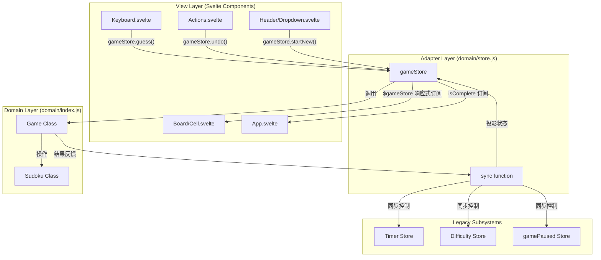

# 数独游戏设计文档 (Homework 1.1)

本作业在 Homework 1 的基础上，重点解决了领域对象与 Svelte 视图层的深度集成。通过建立 **Store Adapter（适配器）**，实现了领域逻辑对 UI 流程的完全接管。

---

## 一、 领域对象改进说明

### 相比 HW1 的改进

| 改进项 | Homework 1 (之前) | Homework 1.1 (现在) |
| :--- | :--- | :--- |
| **接入程度** | 领域对象仅存在于测试中，UI 依然操作旧 Store | 领域对象是核心，所有 UI 事件均调用领域方法 |
| **新旧兼容** | 计时器、难度显示与棋盘状态脱节 | `gameStore` 统一调度，开始新游戏时自动重置计时器和难度 |
| **代码风格** | 领域层代码风格不统一，注释不规范 | 职责清晰，采用标准的JSDoc注释风格 |
| **逻辑严谨性** | 缺乏合法性校验 | 修正了非法落子（修改初始格）、完成判定错误、序列化引用暴露等缺陷 |

#### 为什么 HW1 的做法不足以支撑真实接入？

*   **缺乏通信桥梁**：HW1 的领域对象是孤立的类，Svelte 无法得知类内部数据的变化。
*   **职责重叠**：HW1 的 UI 组件仍然持有大量的逻辑片段（如操作旧数组），导致领域对象沦为装饰。

### 针对评审的核心对象改进

针对 Homework 1 的评审意见，我们对领域模型进行了实质性的安全性与严谨性改进：

1.  **阻止非法落子 (Core)**：
    *   `Game.guess` 现在会首先通过 `isInitialCell` 拦截对初始题面的修改。
    *   `Sudoku.guess` 增加了 `validate` 参数，在落子时即时调用 `isValidPlacement` 校验行、列、宫冲突。
2.  **完善“完成判定” (Core)**：
    *   修改了 `isComplete()` 逻辑：从简单的“检查填满”升级为“填满且无规则冲突”。只有当所有格子非零且通过数独规则校验时才返回 `true`。
3.  **解决状态脱节与写操作延迟 (Major)**：
    *   `Game` 类现在持有并维护一个实时的 `currentSudoku` 实例，所有的 `guess` 操作会立即作用于该实例，而不是等待读取时才重放。
4.  **消除序列化引用暴露 (Major)**：
    *   `toJSON()` 和 `getGrid()` 均使用 `cloneGrid`（深度克隆）返回数据快照，防止外部调用方反向修改领域对象内部状态。
5.  **统一空白格表示 (Major)**：
    *   内部表示统一使用 `0` 代表空白，移除了 `null` 带来的歧义。仅在 `toString()` 外表化时显示为 `.`。
6.  **增加结构性校验 (Minor)**：
    *   构造函数中加入 `_validateStructure`，强制要求输入必须为 9x9 矩阵，否则抛出异常。

### 设计 Trade-offs

#### 1. 性能 vs. 预测性 (Snapshot Overhead)
*   **做法**：我们在每次落子或撤销后，通过 `sync()` 函数对整个棋盘进行深度克隆并生成一个新的快照对象发送给 UI。
*   **权衡**：
    *   **代价（Performance）**：对于 9x9 的数组，这种开销在现代浏览器中微乎其微，但如果数据规模扩大（例如 100x100 的矩阵），频繁的深度克隆和垃圾回收（GC）会导致卡顿。
    *   **收益（Predictability）**：确保了数据的**不可变性（Immutability）**。UI 永远不会意外修改到领域内部的数据，且 Svelte 的响应式系统在接收到新引用时运行最稳定。

#### 2. 开发效率 vs. 架构整洁度 (Boilerplate)
*   **做法**：引入了适配器层（`gameStore.js`）。
*   **权衡**：
    *   **代价（Complexity）**：增加了一定的代码量（Boilerplate）。现在增加一个新功能（如“提示”），需要同时修改领域层（逻辑）、适配器层（同步）和 UI 层（调用）。
    *   **收益（Decoupling）**：实现了**彻底解耦**。领域层可以独立于 Svelte 进行自动化测试。即使未来项目决定改用 React 或 Vue，领域层的代码一行都不用改，只需重写适配器层。

#### 3. 内存占用 vs. 撤销速度 (History Strategy)
*   **做法**：我们在 `Game` 类中只存储了 `moves` 操作日志，撤销（Undo）时需要通过 `_rebuild()` 从初始题面重新重放一遍。
*   **权衡**：
    *   **代价（Speed）**：如果一局游戏进行了几千步操作，Undo 可能会变慢，因为每次都要从第 1 步重算。
    *   **收益（Memory）**：内存占用极低。存储几千个简单的 `move` 对象（坐标+数值）远比存储几千个 9x9 的棋盘快照（Snapshots）节省空间。

#### 4. 架构纯粹性 vs. 遗留系统兼容 (Glue Code)
*   **做法**：在 `gameStore.js` 中保留了大量的“胶水代码”来同步旧系统的 `timer.js`, `difficulty.js` 等。
*   **权衡**：
    *   **代价（Technical Debt）**：`gameStore` 变得比较臃肿，它既要处理新逻辑，又要像“保姆”一样去更新旧 Store 的状态。
    *   **收益（Stability）**：保证了**平滑迁移**。在不重写整个项目（如计时器逻辑、Modal 逻辑）的前提下，让核心玩法（棋盘逻辑）实现了升级。

#### 5. Svelte 3 的技术局限 (Manual Sync)
*   **做法**：手动调用 `sync()` 来通知 UI 更新。
*   **权衡**：
    *   **代价（Error Prone）**：如果开发者增加了一个修改状态的方法却忘记在最后调用 `sync()`，UI 就不会刷新。这在开发过程中是一个潜在的陷阱。
    *   **收益（Compatibility）**：这是在 Svelte 3/4 不支持“深度响应式代理（Deep Proxy）”的情况下，确保 UI 能够感知到类（Class）内部私有状态变化的唯一稳健手段。

## 二、 架构设计

### 2.1 整体架构图

我们采用了 **方案 A (Store Adapter)** 来连接领域对象与 Svelte。

*   **View 层 (Svelte)**：负责渲染数据和发送命令。
*   **Store Adapter (gameStore.js)**：作为“中间人”，持有 `Game` 实例，将其状态投影为响应式 Store。
*   **Domain Layer (index.js)**：纯粹的业务逻辑，不依赖任何 UI 框架。

### 2.2 数据流描述

1.  **指令下行**：当用户点击键盘或撤销按钮时，UI 组件通过 `gameStore` 发送语义化指令（如 `guess`, `undo`）。
2.  **业务处理**：`gameStore` 内部的 `Game` 实例执行逻辑（如修改棋盘、更新历史栈）。
3.  **状态投影 (Sync)**：操作完成后，`sync()` 函数被触发。它将领域对象内部复杂的 `currentSudoku` 状态“投影”为一个简单的 Svelte Store 快照。
4.  **响应式更新**：Svelte 组件订阅了 `$gameStore`，当快照更新时，UI（棋盘、颜色、按钮状态）自动重绘。

### 2.3 接入细节说明

#### 2.3.1 开始一局游戏
*   **入口**：`Welcome.svelte` 或 `Header/Dropdown.svelte`。
*   **动作**：调用 `gameStore.startNew(difficulty)`。
*   **过程**：调用 `generateSudoku` -> 创建 `Sudoku` 实例 -> 创建 `Game` 实例 -> 重置计时器 -> `sync()` 状态。

#### 2.3.2 用户输入与验证
*   **入口**：`Keyboard.svelte`。
*   **动作**：调用 `gameStore.guess(row, col, value)`。
*   **验证**：`Game.guess` 拦截初始格，`Sudoku.guess` 检查值域。`sync()` 过程中通过 `isValidPlacement` 计算出 `invalidCells` 供 UI 标红。

#### 2.3.3 撤销与重做
*   **入口**：`Actions.svelte`。
*   **动作**：调用 `gameStore.undo()` 或 `redo()`。
*   **过程**：`Game` 内部移动 `historyIndex` 指针并重放 `moves` -> 调用 `sync()` 更新视图。

---

## 三、 核心对象说明

### 3.1 Sudoku 类 (`src/domain/index.js`)
**职责**：负责棋盘的原子操作与规则校验。
- **严谨校验**：内置 `_validateStructure` 确保必须为 9x9 矩阵。
- **规则引擎**：提供 `isValidPlacement` 逻辑，支持行、列、九宫格冲突检查。
- **状态快照**：提供 `clone()` 和 `getGrid()`，确保外部无法通过引用修改内部数据。
- **胜利判定**：`isComplete` 不仅检查填满，还检查是否存在规则冲突。

### 3.2 Game 类 (`src/domain/index.js`)
**职责**：管理游戏流程、初始状态保护及历史记录。
- **历史回溯**：使用 `moves` 数组和 `historyIndex` 实现基于操作记录的历史栈。
- **状态恢复**：提供 `_rebuild` 方法，通过重放历史记录重建棋盘状态，确保 Undo/Redo 的数据一致性。
- **封装边界**：保护 `initialGrid`（题面），任何尝试通过 `guess` 修改初始格的行为都会被拦截。

### 3.3 gameStore 适配器 (`src/domain/store.js`)
**职责**：这是本次作业的核心改进，它解决了领域对象如何被 Svelte 消费的问题。
- **单一事实来源**：它是 UI 唯一需要订阅的 Store，持有 `Game` 的运行时实例。
- **逻辑收口**：封装了 `startNew`、`startCustom`、`pause`、`resume` 等复杂动作，内部自动处理计时器重置、难度设置等副作用。
- **实时同步**：每当领域状态变化，它会计算出 `invalidCells`（冲突格坐标）并下发给 UI，实现“填错标红”的实时反馈。

---

## 四、 响应式机制解析

### 1. 依赖机制
本方案主要依赖 Svelte 的 **`writable` store** 机制和 **`$` 自动订阅语法**。
*   我们没有使用复杂的 `$:` 派生（除了 UI 内部的微调），而是选择在适配器层手动控制 `set` 的时机，这被称为**状态投影**。
  
### 2. 响应式暴露 vs 内部留存
*   **响应式暴露的数据**：`grid`, `initialGrid`, `invalidCells`, `isComplete`, `canUndo/canRedo`。这些是 UI 渲染所必需的。
*   **留在领域对象内部的状态**：
    *   **`moves` 历史栈**：UI 不需要知道历史记录的细节，只需要知道“能不能退”。
    *   **`historyIndex` 指针**：管理回溯进度的内部游标。
    *   **`currentSudoku` 实例**：复杂的领域逻辑聚合。

### 3. 响应式边界

**边界位于 `gameStore.js` 的 `sync()` 函数。**
*   **边界内 (领域层)**：是纯 JavaScript 环境，状态变更通过方法调用（Mutation）完成，不具备响应式。
*   **边界外 (UI 层)**：是 Svelte 环境，通过订阅 `gameStore` 产生的快照实现声明式更新。

### 4. Svelte 响应式深入理解

1.  **为什么修改对象内部字段后，界面不一定自动更新？**
    *   因为 Svelte 3/4 的反应性是基于“赋值”的。直接修改对象的属性（如 `obj.a = 1`）不会改变对象本身的引用，如果不重新执行 `obj = obj` 或调用 Store 的 `set`，Svelte 无法追踪到深层的变化。
2.  **为什么直接改二维数组元素，界面不刷新？**
    *   同理，`grid[0][0] = 5` 是一个内部突变。Svelte 监听的是 `grid` 这个变量名的变化。在我们的方案中，必须通过 `gameStore` 调用 `sync` 重新发布整个数组快照来触发更新。
3.  **为什么 Store 可以被 `$store` 消费？**
    *   `$` 是 Svelte 的编译标识符，它会自动处理 `.subscribe` 和组件销毁时的 `.unsubscribe`，简化了对可观察对象（Observable）的访问。
4.  **为什么 `$:` 反应性声明有时更新，有时不更新？**
    *   `$:` 取决于其依赖的变量是否被重新赋值。如果依赖的是一个普通对象的内部属性，且该对象没有被重新赋值，`$:` 块就不会运行。
5.  **为什么“间接依赖”可能导致不触发？**
    *   如果 `$:` 依赖的变量 `A` 是通过非响应式途径获取的（比如在一个普通函数里缓存了快照），那么当源数据变化时，`A` 不会变，导致 `$: B = A + 1` 也不触发。

### 5. 错误Mutate后果

如果错误地在 Svelte 组件中直接 **Mutate（突变）** 领域对象内部字段（例如 `game.currentSudoku.grid[0][0] = 5`）：
1.  **视图不更新**：Svelte 无法检测到这种深层修改，棋盘会维持旧数字。
2.  **状态不一致**：Undo/Redo 历史栈可能不会被同步更新，导致撤销功能失效。
3.  **违反封装性**：UI 层介入了业务规则的实现细节，违反了单一职责原则，使得逻辑难以在测试中复用。

通过 `gameStore` 这一层适配，我们确保了领域对象是 **“Single Source of Truth”（单一事实来源）**，同时也完美契合了 Svelte 的响应式工作流。

---

## 五、核心问题解答

### 1. 视图层消费与状态可见性

1.  **View 层直接消费的是谁？**
    *   View 层直接消费的是 `gameStore`（适配器）。它不直接操作 `Game` 或 `Sudoku` 类，而是通过 `$gameStore` 语法糖订阅投影出的状态，并调用 `gameStore` 暴露的命令方法（如 `guess`, `undo`, `redo`）。

2.  **哪些状态对 UI 可见，哪些不可见？**
    *   **可见状态**：`grid`（当前棋盘）、`initialGrid`（题面）、`canUndo/canRedo`（按钮状态）、`isComplete`（胜负状态）、`invalidCells`（冲突坐标）。
    *   **不可见状态**：`moves` 历史栈、`historyIndex` 指针、`currentSudoku` 实例内部结构。这些被封装在 `Game` 类内部。

3. **View 层拿到的数据是什么？**
通过 `gameStore` 的响应式快照，UI 能够获取以下投影数据：
*   **`grid`**：当前棋盘的 9x9 二维数组（用于渲染数字）。
*   **`initialGrid`**：初始题面的副本（用于区分哪些格子是蓝色的、哪些是锁定的）。
*   **`invalidCells`**：当前冲突格子的坐标数组（如 `["0,1", "5,2"]`，用于标红）。
*   **`isComplete`**：游戏胜负状态（用于弹出胜利窗口）。
*   **`canUndo / canRedo`**：布尔值（用于禁用或启用撤销重做按钮）。
  
4. **用户操作如何进入领域对象？**
*   **点击落子**：`Keyboard.svelte` 捕获点击，调用 `gameStore.guess(row, col, value)`。该方法内部调用 `Game.guess`，执行规则校验并存入历史栈。
*   **历史导航**：`Actions.svelte` 点击按钮，调用 `gameStore.undo()` 或 `redo()`，进入 `Game` 内部的历史指针移动逻辑。
*   **初始化**：`Welcome.svelte` 或 `Dropdown.svelte` 调用 `gameStore.startNew(difficulty)`，在适配器内部销毁旧实例并创建新的 `Game` 与 `Sudoku` 聚合。

5. **领域对象变化后，Svelte 为什么会更新？**
这依赖于**显式同步（Explicit Sync）**机制：
- 领域对象发生内部状态改变（例如 `moves` 增加）。
- 适配器立即执行内部函数 `sync()`。
- `sync()` 调用 Svelte Store 的 `set()` 方法发送一个新的对象快照。
- Svelte 的 store 系统通知所有订阅者（Subscriber），触发 UI 重新渲染。

### 2. 为什么 UI 会自动更新？
UI 会更新是因为我们利用了 Svelte 的 **Store 订阅机制**。
1. `gameStore` 本质上是一个 `writable`。
2. 当我们调用 `gameStore.guess()` 时，内部执行了 `gameInstance.guess()`。
3. 随后立即执行了 `sync()`，在 `sync` 中我们调用了 `set({ ...newSnapshot })`。
4. Svelte 检测到 `gameStore` 的对象引用发生了变化，便会通知所有订阅了 `$gameStore` 的组件（如 `Board`）进行重绘。

### 3. 为什么领域对象变了，界面有时不刷新？
如果在 `Game` 对象内部直接修改 `this.currentSudoku.grid[0][0] = 5`，Svelte 是**无法感知**的。因为 Svelte 的响应式是建立在变量赋值或 Store 的 `set/update` 调用之上的。**本项目通过适配器层的 `sync` 函数显式触发 `set`，完美避开了这个问题。**

### 4. "间接依赖" 问题如何解决？
原系统中，计时器和胜利判定依赖于多个分散的 Store。在重构后，我们将这些“间接依赖”统一收拢。
- **胜利判定**：`App.svelte` 直接订阅 `$gameStore.isComplete`。
- **冲突高亮**：`Cell` 接收来自 `$gameStore.invalidCells` 的投影，实现了数据的一致性和单一事实来源（Single Source of Truth）。

### 5. 迁移与演进

1.  **如果将来迁移到 Svelte 5，哪一层最稳定，哪一层最可能改动？**
    *   **最稳定**：**Domain Layer (领域层)**。它是纯粹的 JS 类，不依赖任何框架。
    *   **最可能改动**：**Store Adapter (适配器层)**。Svelte 5 引入了 `Runes` ($state, $derived)，适配器层可以将现在的 `writable` 替换为更为简洁的响应式类（Reactive Classes），从而去掉显式的 `sync()` 调用。

---

## 六、 关键改动列表

| 文件路径 | 改动描述 |
| :--- | :--- |
| `src/domain/index.js` | 核心领域类实现。增加 `_rebuild`, `isValidPlacement`, `isComplete` 等逻辑。 |
| `src/domain/store.js` | **新增适配器**。封装 `gameStore`，管理游戏生命周期，同步旧系统状态。 |
| `src/components/Board/index.svelte` | 重构 Grid 容器 CSS 布局。数据源改为 `$gameStore.grid`，接入冲突高亮。 |
| `src/components/Controls/Keyboard.svelte` | 按键事件改为调用 `gameStore.guess()`。 |
| `src/components/Controls/ActionBar/Actions.svelte` | 对接 `gameStore.undo()` 和 `gameStore.redo()`。 |
| `src/components/Header/Dropdown.svelte` | 难度切换改为调用 `gameStore.startNew()`，接入暂停恢复逻辑。 |
| `src/App.svelte` | 监听 `$gameStore.isComplete` 触发胜利弹窗和计时停止。 |
| `src/node_modules/@sudoku/stores/grid.js` | 暴露 `set` 方法，允许领域层同步题面。 |

---